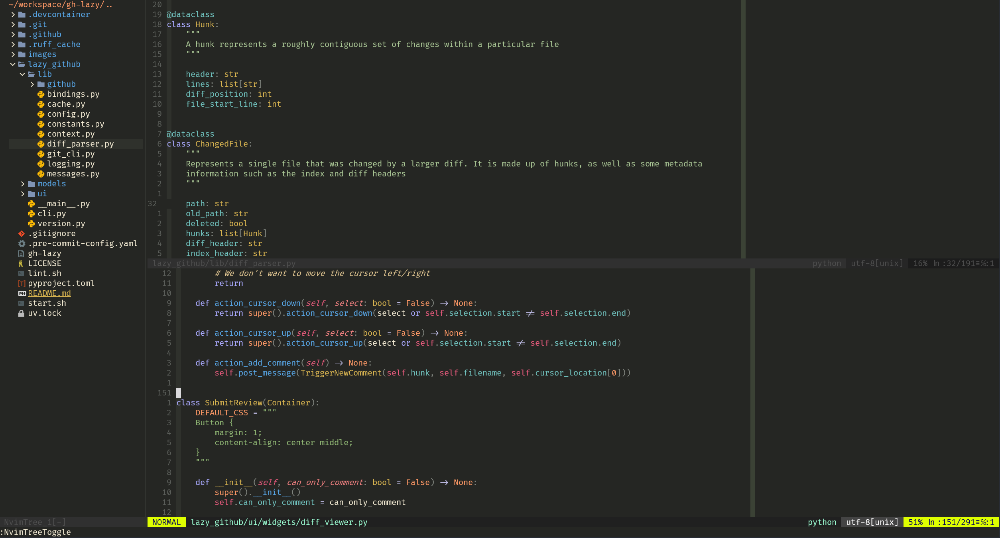

Gizmo's Dotfiles
=======

Configurations for my local and remote development environments.

**Terminal**


**Neovim:**




# Try them out!

If you'd like to try out my dotfiles without installing them, there are a few different options:

### Using Github Codespaces:

There's a `devcontainer.json` defined in the `.devcontainers` folder in this repo! You're welcome to pull that into your own repos if you want to use my dotfiles in your own repo but you can also just click the button below to spin up a codespace and try them for yourself!

[](https://codespaces.new/gizmo385/dotfiles?quickstart=1)

### Using the Prebuilt Image:

A dockerfile including all of my development configs is automatically built and pushed on every commit to this repo. There is a script in the root of this repo that'll pull the latest image from GHCR and run it:

[](https://github.com/gizmo385/dotfiles/actions/workflows/docker-image.yml)

1. Clone the git repo locally
2. Run `./run-in-docker.sh`. This will pull the latest image from GHCR (`ghcr.io/gizmo385/dotfiles:main`) and launch a container.

### Building the Image Locally

1. Clone the git repo
2. Build the docker image with `docker build .`
3. Run the image with `docker run <image-id>` where `<image-id` is the ID of the built image.

# Installation

To fully install the dotfiles in your local environment:

1. Clone the git repo
2. Run `./install.sh`
3. Open a new terminal

The flake this uses to install configurations will select a config based on your hostname. If you don't have a hostname that is specified in `flake.nix`, then you''ll need to separately run:

```
home-manager switch --impure --flake .#default
```

# Updating Packages

Updating packages can be done by running `nix flake update` to generate an updated set of pins for things like nixpkgs. I have a github action that should automatically open a PR with updated pins every Monday.

# Customizing

I use Nix via [home-manager](https://github.com/nix-community/home-manager) and [nixvim](https://github.com/nix-community/nixvim) to manage **all** of my configs. Browse through the nix files to check the settings for individual applications or environments. Machine specific configurations are selected based on hostname and are located in the options directory.
